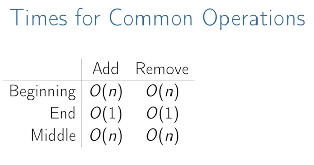

<!--
@Author: Anas Aboureada <anas>
@Date:   Mon, 20th Mar 2017, T 18:45 +01:00
@Email:  me@anasaboureada.com
@Last modified by:   anas
@Last modified time: Mon, 20th Mar 2017, T 19:46 +01:00
@License: MIT License
@Copyright: Copyright (c) 2017 Anas Aboureada <me@anasaboureada.com>
-->

# Arrays

## Resources:

-   [Arrays (local video)](./videos/array.mp4)
-   [Arrays (local pdf)](./slides/arrays_and_lists.pdf)
-   [UCBerkley CS61B - Linear and Multi-Dim Arrays (video)](https://youtu.be/Wp8oiO_CZZE?t=15m32s)
-   [Basic Arrays (video)](https://www.lynda.com/Developer-Programming-Foundations-tutorials/Basic-arrays/149042/177104-4.html)
-   [Multi-dim (video)](https://www.lynda.com/Developer-Programming-Foundations-tutorials/Multidimensional-arrays/149042/177105-4.html)
-   [Dynamic Arrays (video)](https://www.coursera.org/learn/data-structures/lecture/EwbnV/dynamic-arrays)
-   [Jagged Arrays (video)](https://www.youtube.com/watch?v=1jtrQqYpt7g)
-   [Jagged Arrays (video)](https://www.lynda.com/Developer-Programming-Foundations-tutorials/Jagged-arrays/149042/177106-4.html)
-   [Resizing arrays (video)](https://www.lynda.com/Developer-Programming-Foundations-tutorials/Resizable-arrays/149042/177108-4.html)

## Todo:

-   Implement a vector (mutable array with automatic resizing):
-   Practice coding using arrays and pointers, and pointer math to jump to an index instead of using indexing.
-   new raw data array with allocated memory
    -   can allocate int array under the hood, just not use its features
    -   start with 16, or if starting number is greater, use power of 2 - 16, 32, 64, 128
-   size() - number of items
-   capacity() - number of items it can hold
-   is_empty()
-   at(index) - returns item at given index, blows up if index out of bounds
-   push(item)
-   insert(index, item) - inserts item at index, shifts that index's value and trailing elements to the right
-   prepend(item) - can use insert above at index 0
-   pop() - remove from end, return value
-   delete(index) - delete item at index, shifting all trailing elements left
-   remove(item) - looks for value and removes index holding it (even if in multiple places)
-   find(item) - looks for value and returns first index with that value, -1 if not found
-   resize(new_capacity) // private function
    -   when you reach capacity, resize to double the size
    -   when popping an item, if size is 1/4 of capacity, resize to half

## Characteristics:

### Time

-   O(1) to add/remove at end (amortized for allocations for more space), index, or update
-   O(n) to insert/remove elsewhere

### Space

-   contiguous in memory, so proximity helps performance
-   space needed = (array capacity, which is >= n) \* size of item, but even if 2n, still O(n)
    )
