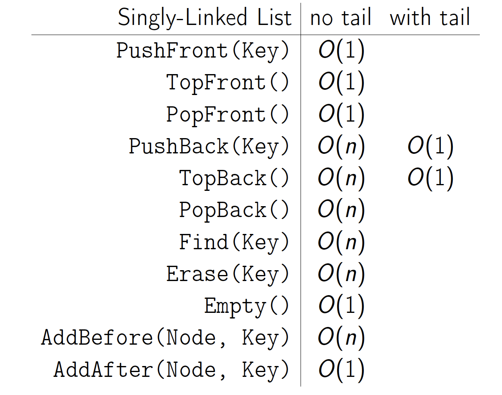
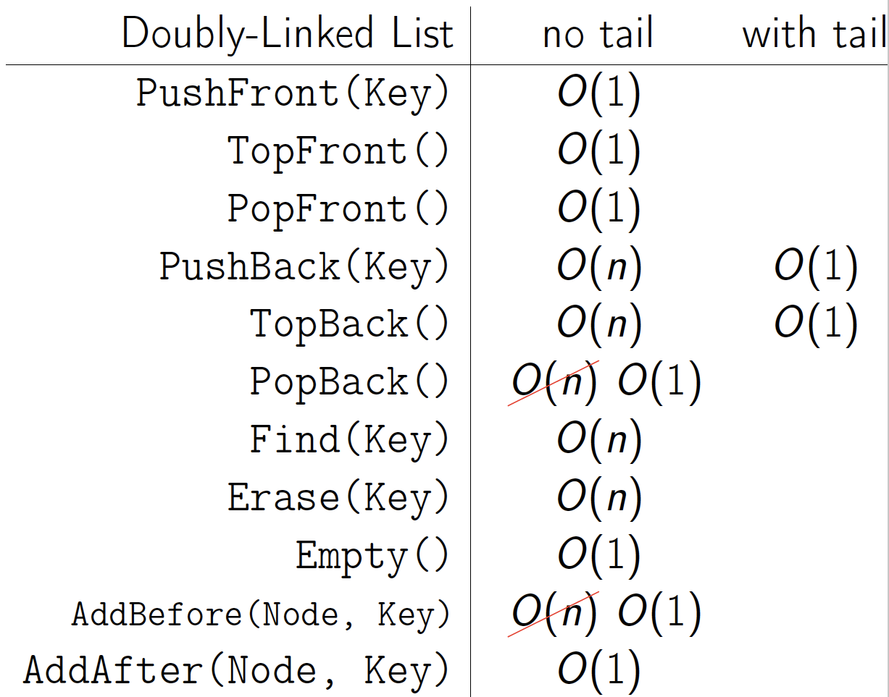

<!--
@Author: Anas Aboureada <anas>
@Date:   Mon, 20th Mar 2017, T 18:53 +01:00
@Email:  me@anasaboureada.com
@Last modified by:   anas
@Last modified time: Mon, 20th Mar 2017, T 19:46 +01:00
@License: MIT License
@Copyright: Copyright (c) 2017 Anas Aboureada <me@anasaboureada.com>
-->

# Linked Lists

## Resources:

-   [Singly Linked Lists (local video)](./videos/singly_linked_lists.mp4)
-   [ Linked Lists (local pdf)](./slides/arrays_and_lists.pdf)
-   [CS 61B - Linked Lists (video)](https://www.youtube.com/watch?v=sJtJOtXCW_M&list=PL-XXv-cvA_iAlnI-BQr9hjqADPBtujFJd&index=5)
-   [C Code (video)](https://www.youtube.com/watch?v=QN6FPiD0Gzo)
    -   not the whole video, just portions about Node struct and memory allocation.
-   Linked List vs Arrays:
    -   [Core Linked Lists Vs Arrays (video)](https://www.coursera.org/learn/data-structures-optimizing-performance/lecture/rjBs9/core-linked-lists-vs-arrays)
    -   [In The Real World Linked Lists Vs Arrays (video)](https://www.coursera.org/learn/data-structures-optimizing-performance/lecture/QUaUd/in-the-real-world-lists-vs-arrays)
    -   [why you should avoid linked lists (video)](https://www.youtube.com/watch?v=YQs6IC-vgmo)
-   Gotcha: you need pointer to pointer knowledge:
      (for when you pass a pointer to a function that may change the address where that pointer points)
      This page is just to get a grasp on ptr to ptr. I don't recommend this list traversal style. Readability and maintainability suffer due to cleverness.
    -   [Pointers to Pointers](https://www.eskimo.com/~scs/cclass/int/sx8.html)
-   [Doubly-linked List (video)](https://www.coursera.org/learn/data-structures/lecture/jpGKD/doubly-linked-lists)

## TODO:

-   Singly Linked List

    -   implement (I did with tail pointer & without):
        -   size() - returns number of data elements in list
        -   empty() - bool returns true if empty
        -   value_at(index) - returns the value of the nth item (starting at 0 for first)
        -   push_front(value) - adds an item to the front of the list
        -   pop_front() - remove front item and return its value
        -   push_back(value) - adds an item at the end
        -   pop_back() - removes end item and returns its value
        -   front() - get value of front item
        -   back() - get value of end item
        -   insert(index, value) - insert value at index, so current item at that index is pointed to by new item at index
        -   erase(index) - removes node at given index
        -   value_n_from_end(n) - returns the value of the node at nth position from the end of the list
        -   reverse() - reverses the list
        -   remove_value(value) - removes the first item in the list with this value

### Singly-Linked Lists Time Complexity

### Doubly-Linked Lists Time Complexity

